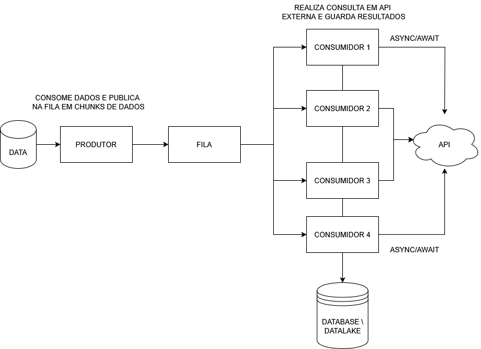

# Projeto de Porgramação Paralela & Distribuída - INE5645
Trabalho de semestre da matéria de Programação Paralela e Distribuída

### Descrição do trabalho a ser feito

Este trabalho explora o uso de padrões para programação multithread. A adoção de
padrões de projeto para programação paralela visa atender requisitos de desempenho,
escalabilidade, extensibilidade, integração, dentre outros. O grupo deverá propor uma
aplicação concorrente de sua preferência, que tenha requisitos relevantes para a aplicação
dos padrões escolhidos.

Para o desenvolvimento desta aplicação, considere implementações concorrentes
envolvendo a sincronização usando threads, processos ou coroutines. Além disso, será
necessário utilizar estruturas de sincronização, como mutex, semáforos, barreiras e
variáveis de condição. Não há restrição quanto a linguagem de programação utilizada,
desde que a mesma explore adequadamente os aspectos de concorrência/paralelismo e
sincronização necessários em sua aplicação.

#### Requisitos e avaliação
Os requisitos específicos são:
* Implementar a aplicação concorrente utilizando pelo menos duas estruturas de
sincronização diferentes e dois padrões de projeto; Deve ser entregue: o código com
descrição (ex. arquivo readme) com detalhes para compilação, implantação e
execução da aplicação;
* Explicação dos da adoção dos dois padrões escolhidos no contexto da aplicação;
* Apresentar em aula, no formato de seminário: a aplicação, detalhando as decisões
de projeto (escolha de padrões e estruturas de sincronização) e os principais
aspectos relacionados à implementação (discussão de tecnologias, configurações,
linguagens e principais trechos de código).
Para a avaliação será considerado:
* A escolha da aplicação e uso adequado dos padrões. Isto significa que o uso dos
padrões faz sentido para a aplicação escolhida;

* Clareza na explicação sobre a adoção dos padrões escolhidos;
* A explicação sobre a implementação, configuração e execução da aplicação.

### Diagrama

