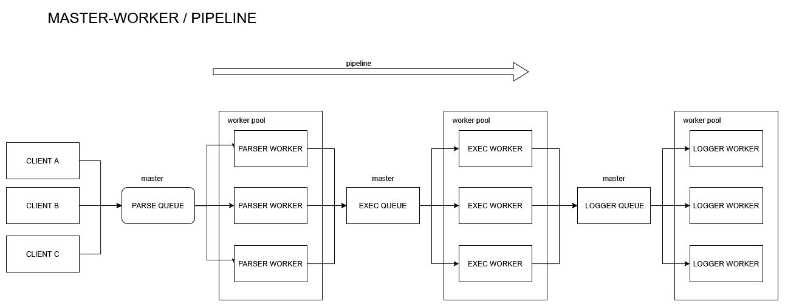

# Mini SGBD Pipeline com Mutex, Cond e Semáforos

Projeto para a disciplina de **Programação Paralela e Distribuída**.

Este projeto implementa um **Mini Sistema Gerenciador de Banco de Dados (SGBD)** concorrente, utilizando **Go** e mecanismos de sincronização manual (→ **Mutex**, **Cond**, **RWMutex**).


## Arquitetura



---

## ✨ Funcionalidades

- **Servidor TCP** que aceita **múltiplos clientes simultâneos**.
- **Pipeline** com três estágios:
  - **Parser** → interpreta comandos.
  - **Executor** → executa ações sobre o banco.
  - **Logger** → envia resultados para o cliente.
- **Master-Worker** em cada estágio, criando workers conforme demanda.
- Controle manual de concorrência sem `channels`.

---

## 🔁 Arquitetura do Pipeline

1. Cliente envia comando.
2. **Parser** interpreta o comando.
3. **Executor** realiza operação no banco de dados.
4. **Logger** envia resposta de volta.

Cada etapa possui uma fila monitorada por um **Master**, que cria **Workers** para processar as tarefas.

**Banco de dados**:
- `db map[string]string` protegido por `sync.RWMutex` para operações de leitura e escrita concorrentes.

---

## 📂 Estrutura do Projeto

- `main.go` → Inicia o servidor, masters e workers.
- `ParsedCommand` → Struct que representa o comando trafegado no pipeline.
- `db` → Banco de dados em memória protegido por `RWMutex`.
- `parseQueue`, `execQueue`, `logQueue` → Filas com controle manual (`Mutex` + `Cond`).

---

## 🚀 Executando

### 1. Requisitos
- Go instalado (versão 1.18 ou superior)

### 2. Rodando o servidor
```bash
# Na pasta do projeto
go run cmd/server/main.go
```

O servidor iniciará ouvindo na porta `:9000`.

### 3. Conectando um cliente

Utilizando o cliente de teste na pasta client:
```bash
cd client
go run .
```

Ou qualquer cliente TCP que envie comandos.

### 4. Exemplos de Comandos

- Definir valor:
```bash
SET nome Joao
```
- Buscar valor:
```bash
GET nome
```

**Resposta esperada**:
```
OK
Joao
```

---

## 📊 Padrões de Projeto Utilizados

| Padrão            | Descrição |
|--------------------|------------|
| **Master-Worker**  | Cada estágio tem um master que cria workers para processar comandos concorrentes. |
| **Pipeline**       | As operações fluem sequencialmente entre Parser → Executor → Logger via filas sincronizadas. |

---

## 🌐 Tecnologias

- Linguagem: **Golang**
- Concorrência manual: **Mutex**, **Cond**, **RWMutex**
- Redes: **net TCP** (cliente-servidor)

---

## 💚 Licença

Projeto acadêmico — uso livre para fins educacionais.

---

Feito com ❤️ para estudo e aprimoramento de paralelismo!